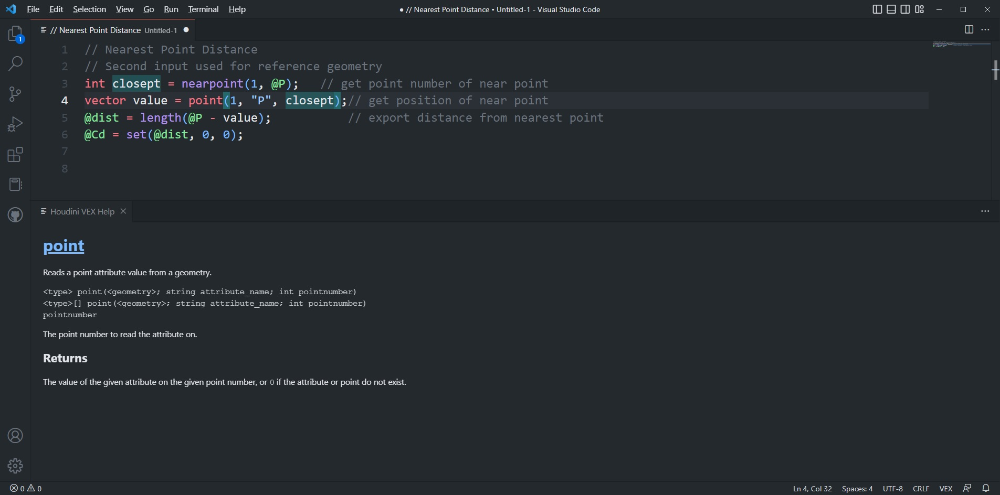
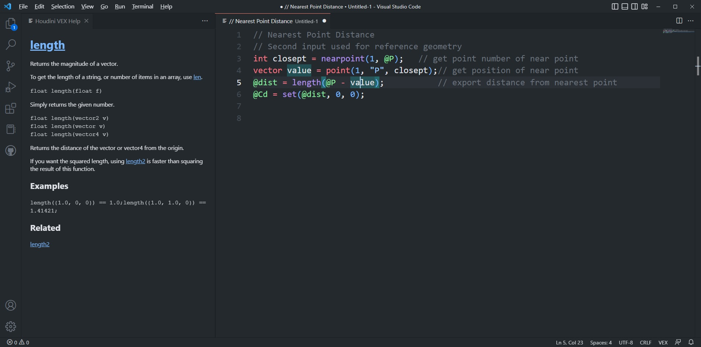
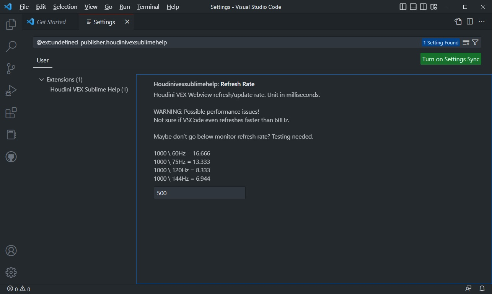

# Houdini VEX Sublime Help for VSCode

## Description
---
Houdini VEX Sublime Help is created as a **companion** extension to VEX ( [VSCode Marketplace](https://marketplace.visualstudio.com/items?itemName=melmass.vex) / [GitHub](https://github.com/melMass/vscode-vex) ) and as a in-editor replacement for Houdini Vex Help ( [VSCode Marketplace](https://marketplace.visualstudio.com/items?itemName=cgtoolbox-guillaume-jobst.houdinivexhelp) / [GitHub](https://github.com/cgtoolbox/vscode-houdinivexhelp) ).

It's using VEX [helpcards.json](https://github.com/teared/VEX/blob/master/commands/helpcards.json) from Sublime [VEX](https://github.com/teared/VEX) add-on.

## Features
---
- Grabs text under editor cursor and display VEX help for it
- Doesn't matter if your cursor is on function name or inside the function (editing arguments)

## Showcase
---

## **WARNING!**
---
Extension uses [Webview](https://code.visualstudio.com/api/extension-guides/webview) and is constantly updating viewer on a fixed interval. May cause performance issues. Testing needed!

FIxed interval is by default set to 500ms.

You can change that value by going on Settings - Extension or by searching `@ext:undefined_publisher.houdinivexsublimehelp`
